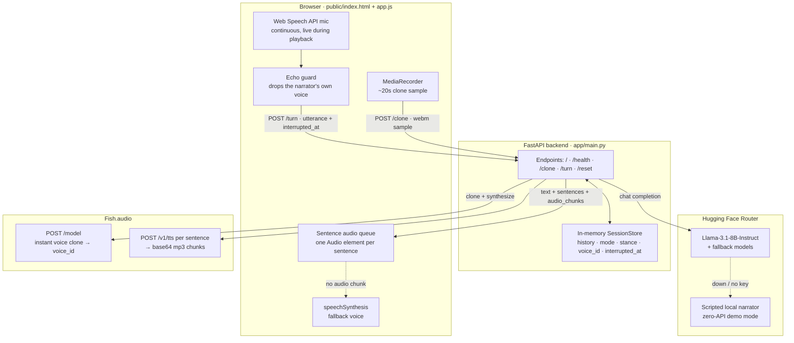
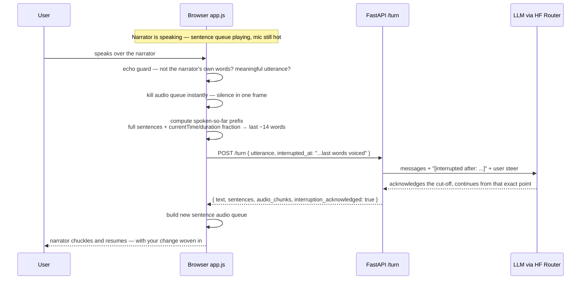

# Once Upon an Interrupt

A browser-based AI storyteller that speaks in a cloned or selected voice, can be interrupted mid-sentence, stops instantly, acknowledges the interruption with humor, and continues the tale from the exact point where it was cut off.

> *"A voice you can interrupt, even when it is yours."*

**🎮 Live playable demo:** **https://nirjara-pixel.github.io/once-upon-an-interrupt/** — a static *lite* build on GitHub Pages: the full interruption engine (barge-in, echo guard, ✂️ interruption point, switch-debate) running entirely in your browser with a scripted narrator and the browser voice. The **full version** below adds the Llama-3.1-8B brain and Fish.audio cloned voices, and runs with one `uvicorn` command. Use Chrome and allow the mic.

**Stack:** FastAPI + vanilla JS · Hugging Face Router (Llama-3.1-8B-Instruct) · Fish.audio voice cloning + TTS · Web Speech API.

**Default narrator: “Sarah”** — a warm Indian female voice (Fish marketplace *Gentle Hindi Female*, `FISH_DEFAULT_VOICE_ID`) that speaks **Hindi (Devanagari), Hinglish and English** at a relaxed human pace. The browser-voice fallback mirrors this by auto-picking Indian voices (Lekha / Google हिन्दी / en-IN) per sentence script, and the LLM persona replies in whichever of the three languages you speak. Cloning your own voice overrides Sarah for that session.

## The problem

**Problem 5 · A Voice You Can Interrupt** — ITGeeks Vibe Coding Round.

The challenge gave only a title and nothing else. So this project **defines its own acceptance criteria** and proves each one on camera in the demo video (see [demo/video_script.md](demo/video_script.md)).

## Self-defined acceptance criteria

1. **Fast start.** The narrator begins speaking within ~1–2 seconds when the APIs are warm. While cold, the UI shows *"The storyteller is clearing their throat…"* — the wait is never silent confusion.
2. **True barge-in.** The microphone stays live *while the narrator is speaking*. Meaningful speech kills the audio instantly, the UI marks the interruption point (✂️ *Interrupted after: "…the last words voiced"*), and the next model turn receives that `interrupted_at` context.
3. **Graceful acknowledgment.** The narrator reacts to being cut off playfully — *(chuckles) You cut me off mid-flourish…* — then weaves the user's steer into the continuation. Interruption is a feature, not an error.
4. **Voice cloning.** Record ~20 seconds in the browser → Fish.audio instant clone → `voice_id` → the story is told in *your* voice. Graceful fallbacks: Fish standard voice → browser `speechSynthesis`.
5. **Typed interruption fallback.** If the mic is blocked or recognition is unsupported, typing + Enter/Send stops the audio and interrupts just the same.
6. **Two modes.**
   - 📖 **Story Mode** — interrupt to steer the plot ("make the dragon my strict professor").
   - 🎭 **Switch Debate Mode** — the narrator argues one side; say **"switch"** and it flips its stance humorously mid-argument.

## Architecture

### Component and data flow



### The interruption, step by step



## API reference

| Method | Path | Request body | Purpose |
|---|---|---|---|
| `GET` | `/` | — | Serves the single-page UI. |
| `GET` | `/health` | — | `{"ok": true, "service": "once-upon-an-interrupt"}` |
| `POST` | `/clone` | multipart `audio` file (webm) | Fish.audio instant clone → `{ok, voice_id, provider}`; degrades to `ok: false` + fallback message. |
| `POST` | `/turn` | `session_id`, `mode` (`story`\|`debate`), `utterance`, `interrupted_at?`, `voice_id?`, `force_fallback_tts?` | One narrator turn: LLM text + per-sentence TTS. |
| `POST` | `/reset` | `session_id` | Forgets the session (history, stance, voice). |

Example `/turn` response:

```json
{
  "ok": true,
  "session_id": "s-ab12cd34",
  "text": "(chuckles) You cut me off mid-flourish... Very well, the dragon adjusted its spectacles and became your strict professor.",
  "sentences": [
    "(chuckles) You cut me off mid-flourish...",
    "Very well, the dragon adjusted its spectacles and became your strict professor."
  ],
  "audio_chunks": ["<base64 mp3>", "<base64 mp3>"],
  "provider": "fish.audio",
  "llm_provider": "huggingface",
  "stance": "neutral",
  "interruption_acknowledged": true
}
```

`audio_chunks[i]` pairs with `sentences[i]`; a `null` chunk tells the client to speak that sentence with `speechSynthesis`. `provider` is `"fish.audio"` only if at least one sentence actually got audio, else `"browser-fallback"`. `llm_provider` is `"huggingface"` or `"local-fallback"`.

## How the interruption engine works

Everything voice-critical lives client-side, so stopping is instant — no network round-trip stands between your voice and silence.

- **Continuous recognition during playback.** `SpeechRecognition` runs with `continuous: true` + `interimResults: true` and auto-restarts on `onend`, so the mic is hot the entire time the narrator speaks.
- **Echo guard.** Each transcript is normalized and compared against the narrator's current sentence + last full reply: if it's a substring of that recent text, or (for 4+ word transcripts) more than **0.75 word-overlap** with it, it's treated as the narrator's own voice leaking into the mic and dropped.
- **Meaningful-utterance filter.** Random noise doesn't interrupt: a transcript must be at least 2 words / 6 characters — *unless* it's a single command word like `switch`, `flip`, `opposite`, `stop`, or `wait`, which always passes.
- **Spoken-text tracking.** The client logs each fully-played sentence, and for the sentence currently playing estimates the voiced word count from the `<audio>` element's `currentTime / duration` fraction. On interrupt it joins that prefix, keeps the **last ~14 words**, and sends them as `interrupted_at` — which the server injects into the prompt as *"The narrator was interrupted after: '…' — react, then continue from that exact point."*
- **Kill switch.** Interrupting empties the queue, pauses the current `<audio>`, and cancels `speechSynthesis` in one synchronous function — then the ✂️ marker and the next `/turn` fire.

## Features

- Interrupt by **voice** (barge-in while the narrator speaks), by **typing**, or with the big red **✋ INTERRUPT NOW** button.
- **Exact-point resume** via the spoken-so-far tracking above.
- **Voice cloning** from a ~20s in-browser recording (Fish.audio `train_mode: fast`, private model).
- **Per-sentence TTS**: the reply is split into sentences and synthesized in parallel, so the first sentence plays while the rest are still queued (`MAX_TTS_SENTENCES = 8` caps free-tier spend).
- **Switch Debate Mode** with server-side stance tracking (`advantages` ↔ `disadvantages`) and humorous pivot announcements.
- **Layered fallbacks** at every hop — the demo degrades, it never dies.

## Fallback matrix

| Layer | Failure | Degrades to | Interruption still works? |
|---|---|---|---|
| LLM | Hugging Face down / rate-limited / no key | Fallback models (Mistral-7B, Zephyr-7B), then a **scripted local narrator** with zero APIs | ✅ |
| TTS | Fish.audio 402 / down / no key | **Browser `speechSynthesis`** per sentence; stage directions like *(chuckles)* stripped before speaking | ✅ |
| Mic | Permission denied / no `SpeechRecognition` | UI says so; **typed interruptions** (Enter/Send) take over completely | ✅ |
| Clone | Fish `/model` declines | Fish standard demo voice, then browser voice | ✅ |

## Current status — honest note

- **Hugging Face path: LIVE.** `meta-llama/Llama-3.1-8B-Instruct` via the router (`https://router.huggingface.co/v1/chat/completions`) generates the narration.
- **Fish.audio: LIVE via the free S2.1 Pro tier.** Setting the `model: s2.1-pro-free` header ([Fish's free-API promo](https://fish.audio/blog/s2-1-pro-free-api/)) makes both **TTS and instant voice cloning** work with no API credit — verified live (200 on TTS with the Sarah voice, 201 on clone). Configured via `FISH_TTS_MODEL=s2.1-pro-free`. Notes: fair-use limits, no SLA, requests may be used by Fish for model improvement. Paid model names (`s1`, `speech-2.5-pro`) return 402 until the API wallet is funded at <https://fish.audio/app/developers>.
- Until then the **browser `speechSynthesis` voice carries the demo** — interruption, exact-point resume, and debate switching are all fully functional on it.

## Setup

```bash
git clone <this repo>
cd once-upon-an-interrupt
python3 -m venv .venv
source .venv/bin/activate
pip install -r requirements.txt
cp .env.example .env   # then fill in your keys
```

## Environment variables

| Variable | Required | Default | Purpose |
|---|---|---|---|
| `FISH_AUDIO_API_KEY` | For cloned/Fish TTS | — | Fish.audio key for voice cloning + TTS. Unset/`replace_me` → browser voice. |
| `HUGGINGFACE_API_KEY` | For LLM turns | — | Hugging Face token for the router chat API. Unset/`replace_me` → scripted local narrator. |
| `HF_MODEL` | No | `meta-llama/Meta-Llama-3.1-8B-Instruct` | Primary chat model; fallback models are tried automatically. |
| `FISH_TTS_MODEL` | No | `s1` | Fish TTS `model` header. Run `python scripts/smoke_test_fish.py` to find which one your key supports (e.g. `s1`, `speech-1.5`, `speech-2.5-pro`). |
| `APP_ENV` | No | `development` | Environment label. |

## Run locally

```bash
uvicorn app.main:app --reload
```

Open **http://localhost:8000** in Chrome (best Web Speech API support). Health check at `/health`.

## Run tests

```bash
python -m pytest
```

Smoke-test the live APIs (reads your `.env`, never prints keys):

```bash
python scripts/smoke_test_hf.py
python scripts/smoke_test_fish.py
```

## Project structure

```
once-upon-an-interrupt/
├── app/
│   ├── main.py                  # FastAPI app: /, /health, /clone, /turn, /reset
│   ├── config.py                # env-driven settings, has_fish / has_hf guards
│   ├── models.py                # TurnRequest / ResetRequest pydantic models
│   ├── services/
│   │   ├── hf_llm.py            # HF router chat + scripted local fallback
│   │   ├── fish_audio.py        # Fish.audio clone + per-sentence TTS
│   │   ├── fallback_tts.py      # provider contract for the browser fallback
│   │   └── session_store.py     # in-memory sessions
│   └── tests/                   # pytest: /turn logic + session store
├── public/
│   ├── index.html               # single-page UI
│   ├── app.js                   # interruption engine: mic, echo guard, queue
│   └── styles.css
├── scripts/
│   ├── smoke_test_hf.py         # which HF models your key can reach
│   └── smoke_test_fish.py       # which Fish TTS model header works
├── demo/video_script.md         # 90-second shot-by-shot recording plan
└── .github/workflows/ci.yml     # tests on push + manual API smoke job
```

## Demo

The 90-second shot-by-shot recording plan lives in [demo/video_script.md](demo/video_script.md): README + problem selection → voice clone → Story Mode barge-in ("make the dragon my strict professor") → Switch Debate Mode ("switch") → repo + green tests.

## Known limitations

- **Web Speech API** needs Chrome (desktop or Android). iOS Safari's recognition is flaky — use the typed interruption fallback there.
- The **echo guard is a heuristic** (substring + word-overlap on the narrator's recent text). On loudspeakers it can occasionally miss; **use earphones for the live demo** so the mic never hears the narrator at all.
- **Sessions are in-memory** — a server restart forgets story history, stance, and cloned `voice_id` (the Fish model itself persists on their side).
- Interruption-point precision is per-word for Fish mp3 playback (time-fraction estimate) but only per-sentence for the `speechSynthesis` fallback.

## Security note

- **No keys live in this repo.** `.env` is gitignored; only `.env.example` (placeholders) is committed.
- All secrets are read from environment variables at runtime (`app/config.py`).
- CI reads keys from **GitHub Actions repo secrets** (`FISH_AUDIO_API_KEY`, `HUGGINGFACE_API_KEY`) and only in the manually-triggered smoke job — the default test job needs no secrets.

---

## Team / submission

**MEDICAPS UNIVERSITY · AI 2027 batch** · ITGeeks Vibe Coding Round · **Problem 5 — A Voice You Can Interrupt**
